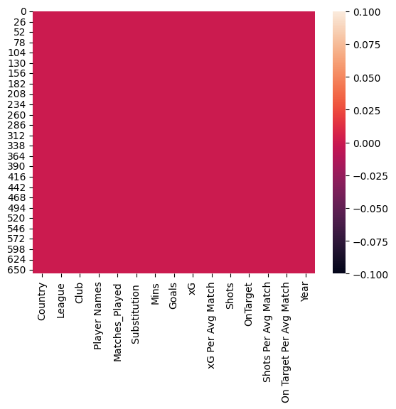

# Laporan Proyek Machine Learning
### Nama : Muhamad Iqbal
### Nim : 211351088
### Kelas : Pagi B

## Domain Proyek

Proyek estimasi jumlah gol dalam liga dapat melibatkan penggunaan data historis dan analisis statistik untuk memprediksi jumlah gol yang mungkin terjadi selama musim kompetisi tertentu. Dengan mengintegrasikan data seperti performa tim dan pemain, kecenderungan gol pada pertandingan sebelumnya.

## Business Understanding

Dapat membantu para analis dan penggemar sepak bola untuk mendapatkan informasi data historis dan statistik pada club club terkait

Bagian laporan ini mencakup:

### Problem Statements

Aksesibilitas informasi gol secara real-time dan komprehensif untuk para analis dan penggemar sepak bola, menyediakan informasi gol yang dapat dipersonalisasi sesuai preferensi pengguna.

### Goals

Agar lebih mudah bagi para analis dan penggemar sepak bola dalam mencari informasi data historis dan statistik

    ### Solution statements
    - Menyediakan platform yang memungkinkan analisis mendalam terhadap tren dan pola terkait gol dalam berbagai kompetisi         sepak bola.
    - Mengembangkan model machine learning dengan menggunakan metode Regresi Linier.

## Data Understanding
Menggunakan dataset yang berasal dari kaggle yang berisi informasi mengenai jumlah gol, yang mencakup berbagai variabel yang berkaitan dengan olahraga sepak bola.<br> 
[top football leagues scores](https://www.kaggle.com/datasets/mohamedhanyyy/top-football-leagues-scorers/data)

Selanjutnya uraikanlah seluruh variabel atau fitur pada data. Sebagai contoh:  

### Variabel-variabel pada Heart Failure Prediction Dataset adalah sebagai berikut:
- Country : Negara yang menjalankan liga
- League : Pertandingan yang bersekala
- Club : Sebuah team
- Player Names : Nama Pemain
- Matches_Played : Jumlah pertandingan yang sudah dimainkan dalam kompetisi
- Substitution : Pemain yang masuk ke pertandingan untuk menggantikan pemain lain
- Mins : Durasi pertandingan
- Goals : Jumlah gol yang dicetak oleh para pemain
- xG : mengukur peluang seberapa besar suatu tembakan akan menghasilkan gol
- xG_Per_Avg_Match : jumlah rata-rata peluang gol yang diharapkan dalam setiap pertandingan
- Shots : Jumlah tembakan dihasilkan
- OnTarget : Jumlah tembakan yang diarahkan tepat ke gawang lawan
- Shots_Per_Avg_Match : Rata-rata jumlah percobaan tembakan yang dilakukan oleh seorang pemain dalam setiap pertandingan
- On_Target_Per_Avg_Match : rata-rata jumlah percobaan tembakan ke arah gawang lawan yang dilakukan oleh seorang pemain dalam setiap pertandingan.
- Year : Tahun dijalankannya liga (2016-2020)

## Data Preparation

## Data Collection

Untuk data yang digunakan menggunakan dataset dengan nama top footballleagues scores yang didapat di website kaggle.

## Data Discovery and Profiling

Dikarnakan menggunakan google collab maka harus mengimport file dan mengupload token yang di download dari kaggle terlebih dahulu agar bisa mendownload file dataset dari kaggle melalui google colab

```python
from google.colab import files
files.upload()
```
Setelah mengupload token, selanjutnya kita akan membuat folder untuk menyimpan file kaggle.json yang sudah diupload

```python
!mkdir -p ~/.kaggle
!cp kaggle.json ~/.kaggle/
!chmod 600 ~/.kaggle/kaggle.json
!ls ~/.kaggle
```
Sudah berhasil, langkah selanjutnya kita download datasetnya

```python
!kaggle datasets download -d mohamedhanyyy/top-football-leagues-scorers
```

mari kita extract file yang telah di download tadi

```python
!mkdir top-football-leagues-scorers
!unzip top-football-leagues-scorers.zip -d top-football-leagues-scorers
!ls top-football-leagues-scorers
```
setelah proses extract selesai, mari kita import library yang dibutuhkan

```python
import pandas as pd
import numpy as np
import matplotlib.pyplot as plt
import seaborn as sns
```

setelah itu kita masukkan file csv yang telah diextract pada sebuah variabel

```python
df= pd.read_csv('sleep-health-and-lifestyle-dataset/Sleep_health_and_lifestyle_dataset.csv')
```

kita lihat 5 baris teratas pada dataset kita

```python
df.head()
```
kita lihat type data pada masing-masing kolom yang ada di dataset kita
```python
df.info()
```
lalu kita akan memeriksa apakah terdapat baris yang kosong atau null pada dataset kita dengan menggunakan seaborn

```python
sns.heatmap(df.isnull())
```
<br>
jika data kita aman maka kita lanjut dengan data exploration kita

```python
plt.figure(figsize=(10,8))
sns.heatmap(df.corr(), annot=True)
```
.png)<br>

untuk tahap selanjutnya mari kita lihat jumlah gol sesuai nama club
```python
PlayerNames = df.groupby('Player Names').count()[['Goals']].sort_values(by='Goals',ascending=True).reset_index()
PlayerNames = PlayerNames.rename(columns={'Goals':'Goals'})
```
```python
fig = plt.figure(figsize=(15,5))
sns.barplot(x=PlayerNames['Player Names'], y=PlayerNames['Goals'], color='royalblue')
plt.xticks(rotation=60)
```
.png)<br>
data diatas menampilkan nama-nama club sesuai dengan jumlah gol yang diperolehnya, dimana club yang memperoleh gol paling banyak yaitu PSG.

tahap berikutnya kita akan melihat jumlah gol sesuai dengan pertandingan yang dimainkan.
```python
Goals= df.groupby('Goals').count()[['Matches_Played']].sort_values (by='Matches_Played').reset_index()
Goals= Goals.rename(columns={'Matches_Played':'Matches_Played'})
```
```python
plt.figure(figsize=(15,5))
sns.barplot(x= Goals['Goals'], y= Goals['Matches_Played'], color='royalblue')
plt.xticks(rotation=60)
```
.png)<br>
data diatas menampilkan jumlah gol sesuai dengan pertandingan yang dimainkan.

Selanjutnya kita akan membuat distribusi dari Goals
```python
plt.figure(figsize=(15,5))
sns.distplot(df['Quality of Sleep'])
```
.png)<br>
Dari diagram diatas kita telah mendapatkan nilai distribusi dari Goals.

berikutnya kita akan lanjut ke tahap modelling.

## Modeling
 tahap pertama yaitua seleksi fitur, kita akan memilih kolom yang dijadikan fitur dan kolom yang dijadikan target.

 ```python
feature = ['Mins',	'Matches_Played',	'xG',	'xG Per Avg Match',	'Shots',	'OnTarget',	'Shots Per Avg Match',	'On Target Per Avg Match',	'Year']
x = df[feature]
y = df['Goals']
x.shape, y.shape
```
untuk hasilnya kita mendapatkan 660 baris 9 kolom untuk fitur dan 660 baris 1 kolom untuk target.

Tahap selanjutnya mari kita lakukan split data, kita masukkan library dan kodenya
```python
from sklearn.model_selection import train_test_split
x_train, x_test, y_train, y_test = train_test_split(x,y,random_state=70)
y_test.shape
```
setelah di split dari 660 data kita ambil 165 data untuk data testingnya.

Jika sudah split data, kita akan membuat model untuk regresi liniernya
```python
from sklearn.linear_model import LinearRegression
lr = LinearRegression()
lr.fit(x_train,y_train)
pred = lr.predict(x_test)
```
jika sudah kita akan melihat akurasi dari model kita
```python
score = lr.score(x_test, y_test)
print('akurasi model regresi linier = ', score)
```
Ternyata akurasi model regresi linier yang kita dapatkan yaitu 0.8607584170460145 atau sama dengan 86%.

setelah itu kita akan Membuat inputan model regresi linier
```python
#Mins= 2071, Matches_Played=22, xG=13, xG Per Avg Match=1, Shots=37, OnTarget=26, Shots Per Avg Match=7, On Target Per Avg Match=3, Year=2020
input_data = np.array([[2071,22,13,1,37,26,7,3,2019]])

prediction = lr.predict(input_data)
print('Estimasi Gol yang dihasilkan permusim :', prediction)
```
jika sudah berhasil maka kita akan menyimpan model yang telah kita buat

```python
import pickle
filename = 'estimasi_jumlahgol.sav'
pickle.dump(lr,open(filename,'wb'))
```

## Evaluation
Pada tahap ini saya menggunakan metric evaluasi R squared

- R-squared, atau disebut juga koefisien determinasi, adalah metrik statistik yang digunakan dalam analisis regresi untuk mengevaluasi seberapa baik model regresi sesuai dengan data yang diberikan. kita dapat menghitungnya dengan rumus dibawah ini:
.jpg)<br>
- setelah itu mari kita terapkan melalui kode menggunakan fungsi R Squared 

```python
from sklearn.linear_model import LinearRegression
from sklearn.metrics import r2_score

# Memasukkan fitur dan target
feature = ['Mins', 'Matches_Played', 'xG', 'xG Per Avg Match', 'Shots', 'OnTarget', 'Shots Per Avg Match', 'On Target Per Avg Match', 'Year']
x = df[feature]
y = df['Goals']

# Membuat model dan melatihnya
model = LinearRegression()
model.fit(x, y)

# Melakukan prediksi menggunakan model
y_pred = model.predict(x)
r_squared = r2_score(y, y_pred)

# Menampilkan R-squared
print("Nilai akurasi R-squared (R^2):", r_squared)
```
nilai R-squared yang kita dapatkan, yaitu 0.8542726918258634, berarti sekitar 85.43% variabilitas dalam jumlah gol dapat dijelaskan oleh fitur-fitur yang digunakan dalam model regresi linear. Dengan demikian, semakin mendekati 1 nilai R-squared, semakin baik model regresi linear tersebut dapat menjelaskan variasi data.

## Deployment

[Estimasi jumlah gol](https://estimasi-jumlah-gol-pemain-sepakbola-e3rzzdbujwpbew7hftfmrg.streamlit.app/)

